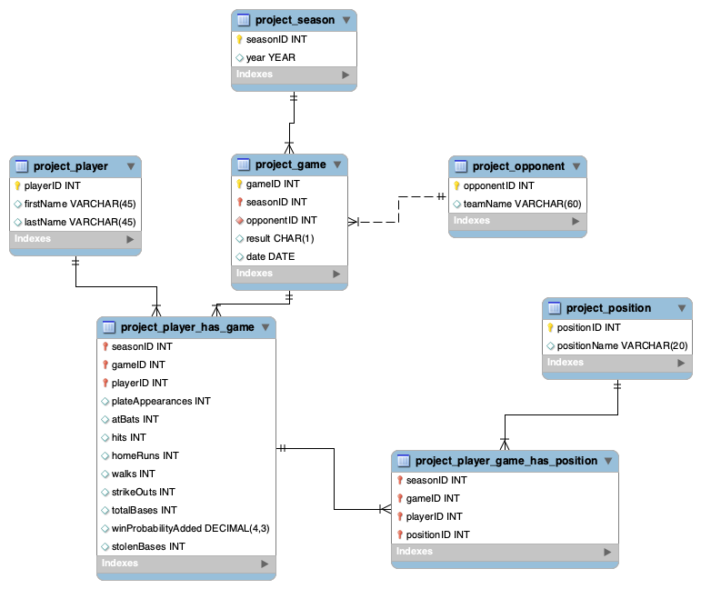

# Database Pipeline Project

A full-stack data pipeline that loads baseball player game logs from a CSV file into a normalized MySQL database. Built with Python and PyMySQL, the pipeline automatically resolves entity references (players, seasons, opponents, positions) and inserts per-game statistics in batches.

---

## Architecture

### Database Design (3rd Normal Form)

The schema consists of 7 tables across 4 entities:

| Table | Description |
|---|---|
| `project_player` | Unique players (auto-incrementing ID) |
| `project_season` | Season years |
| `project_opponent` | Opponent team names |
| `project_game` | Individual games (date, result, opponent, season) |
| `project_position` | Defensive positions |
| `project_player_has_game` | Per-game batting stats for each player |
| `project_player_game_has_position` | Position(s) played by each player per game |



### Pipeline Flow
Player Game Log.csv
↓
Python Insertion Script
├── Resolve or insert: Season, Opponent, Player, Position
├── Insert: Game record
├── Insert: Player-game stats
└── Insert: Player-game-position mapping
↓
MySQL Database (roconnor7)

 Database Pipeline Project

A full-stack data pipeline that loads baseball player game logs from a CSV file into a normalized MySQL database. Built with Python and PyMySQL, the pipeline automatically resolves entity references (players, seasons, opponents, positions) and inserts per-game statistics in batches.

---

## Architecture

### Database Design (3rd Normal Form)

The schema consists of 7 tables across 4 entities:

| Table | Description |
|---|---|
| `project_player` | Unique players (auto-incrementing ID) |
| `project_season` | Season years |
| `project_opponent` | Opponent team names |
| `project_game` | Individual games (date, result, opponent, season) |
| `project_position` | Defensive positions |
| `project_player_has_game` | Per-game batting stats for each player |
| `project_player_game_has_position` | Position(s) played by each player per game |

### Pipeline Flow

Player Game Log.csv
↓
Python Insertion Script
├── Resolve or insert: Season, Opponent, Player, Position
├── Insert: Game record
├── Insert: Player-game stats
└── Insert: Player-game-position mapping
↓
MySQL Database (roconnor7)

---

## Stats Tracked Per Game

| Column | Description |
|---|---|
| `plateAppearances` | Total plate appearances |
| `atBats` | Official at-bats |
| `hits` | Hits |
| `homeRuns` | Home runs |
| `walks` | Walks (BB) |
| `strikeOuts` | Strikeouts |
| `totalBases` | Total bases |
| `winProbabilityAdded` | WPA (decimal) |
| `stolenBases` | Stolen bases |

---

## Setup

### Requirements

- Python 3.x
- MySQL server
- PyMySQL

```bash
pip install pymysql
```

### Database Initialization

Run the schema creation script in your MySQL environment:
mysql -u <user> -p < "Database Design/Database Creation Script.sql"

### Running the Pipeline

Update the connection credentials in Python Insertion Script.py, then run:
python "Data Insertion/Python Insertion Script.py"

The script processes the CSV in batches of 100 rows and logs progress and any errors to the console.

Project Structure
├── Data/
│   └── Player Game Log.csv          # Source baseball statistics data
├── Data Insertion/
│   └── Python Insertion Script.py   # ETL pipeline script
├── Database Design/
│   └── Database Creation Script.sql # Schema definition (3NF)
└── README.md


## License
Copyright (c) 2026 Ryan Patrick O'Connor. All rights reserved.
Non-commercial use permitted with required attribution. See LICENSE.md (https://claude.ai/claude-code-desktop/LICENSE.md) for full terms.
